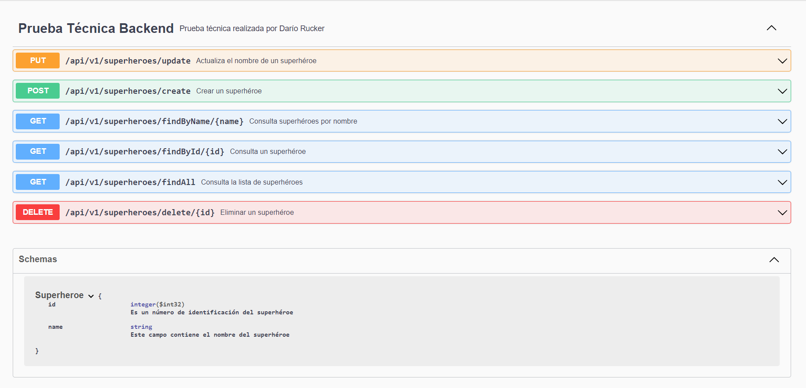

# Prueba técnica Spring Boot

### Importante: Se debe utilizar la última versión LTS de Java, Spring Boot y de cualquier librería utilizada en el proyecto.

En este caso, he aplicado la versión LTS más utilizada de Java, es decir, la 17 y la versión 3 de Spring.

### Desarrollar, utilizando Maven, Spring Boot, y Java, una API que permita hacer un mantenimiento CRUD de súper héroes.
### Este mantenimiento debe permitir:

* Consultar todos los súper héroes.
* Consultar un único súper héroe por id.
* Consultar todos los súper héroes que contienen, en su nombre, el valor de un parámetro enviado en la petición. Por ejemplo, si enviamos “man” devolverá “Spiderman”, “Superman”, “Manolito el fuerte”, etc.
* Crear un súper héroe.
* Modificar un súper héroe.
* Eliminar un súper héroe.
* Test unitarios de como mínimo un servicio: 
  * He realizado los test de la capa service

### Puntos a tener en cuenta:

* Los súper héroes se deben guardar en una base de datos. Puede ser, por ejemplo, H2 en memoria. 
  * He utilizado una base MySQL dockerizada
* La prueba se debe presentar en un repositorio de Git. No hace falta que esté publicado. Se puede enviar comprimido en un único archivo.
  * La solución se encuentra subida en el repo de Github: https://github.com/darucker/pruebaTecnicaBE
 
### Puntos opcionales de mejora incluídos:

* Test de integración
  * Realizado utilizando Testcontainer
* Gestión centralizada de excepciones.
  * Incluída en la carpeta exception 
* Presentar la aplicación dockerizada.
  * Se incluye docker-compose.yml con la dockerizacion de la base de datos.
* Documentación de la API.
  * Realizada mediante Swagger a través de http://localhost:8080/swagger-ui/index.html

